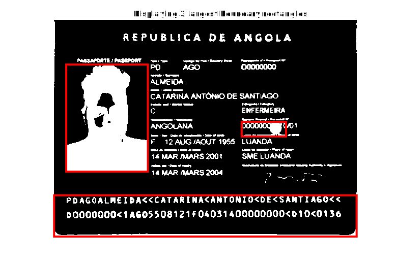
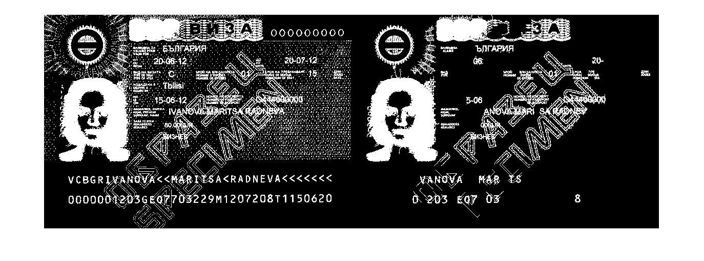

# Results obtained during the `id-card-analysis` project

## 2021.11.26: Boundary rectangles

We were able to draw boundary rectangles around the 3 largest interest regions of the scan. Coincidently, one of the boundary rectangles was around the MRZ, but this result was not reproducible on other scans. The picture, however, could be detected relatively reliably. All of this was done in a matlab live script.

**Approach (A1):**

- We make a histogram of the scan and defined a threshold by hand to then binarize the scan.
- We then compute all regions of interest and select the 3 larger area ones.
- We represents the rectangles on the original BW image.

## 2021.12.17: Apply function to array of images

- We managed to load all images recursively using `imageDataStore()`
- The commands of the live script were placed in a standalone function `locatePicture()`, that is called on the array of images.

Enhancements of approach 1 (A1+):

- Threshold value is computed automatically using `otsuthresh()`
- Small objects of the BW image are removed using `bwareaopen()` -> noise reduction

Noise reduction with `bwareaopen()`, objects size = 100.

Applying `locatePicture()` function to an array of images (without `bwareaopen()`!)

