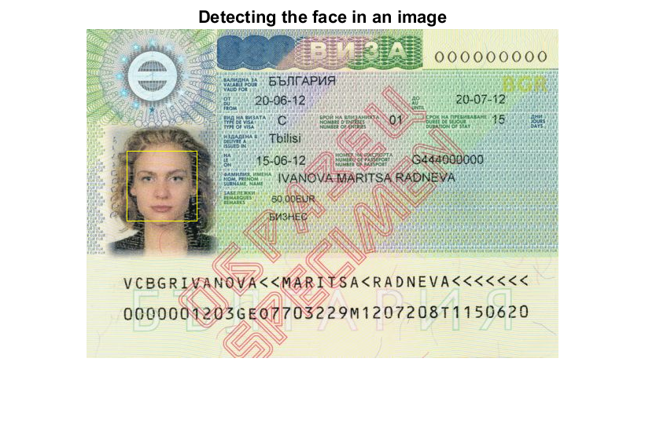
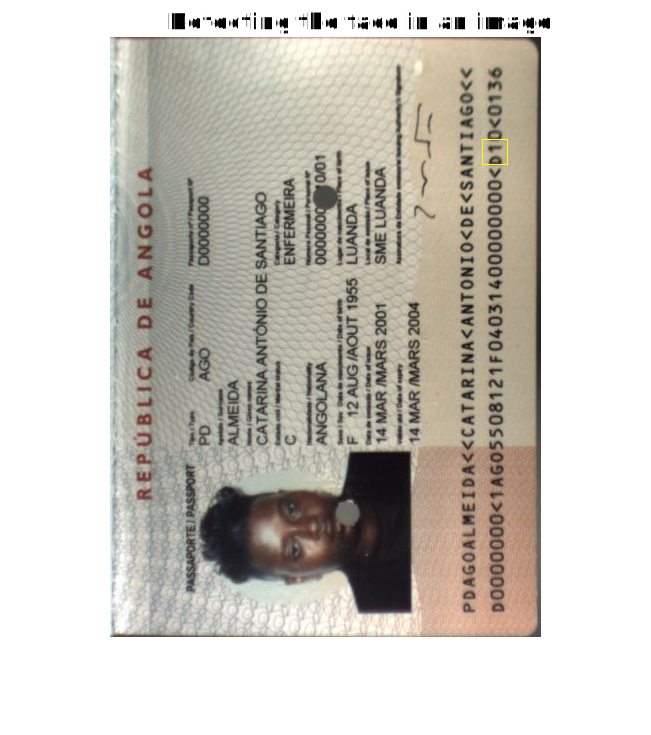
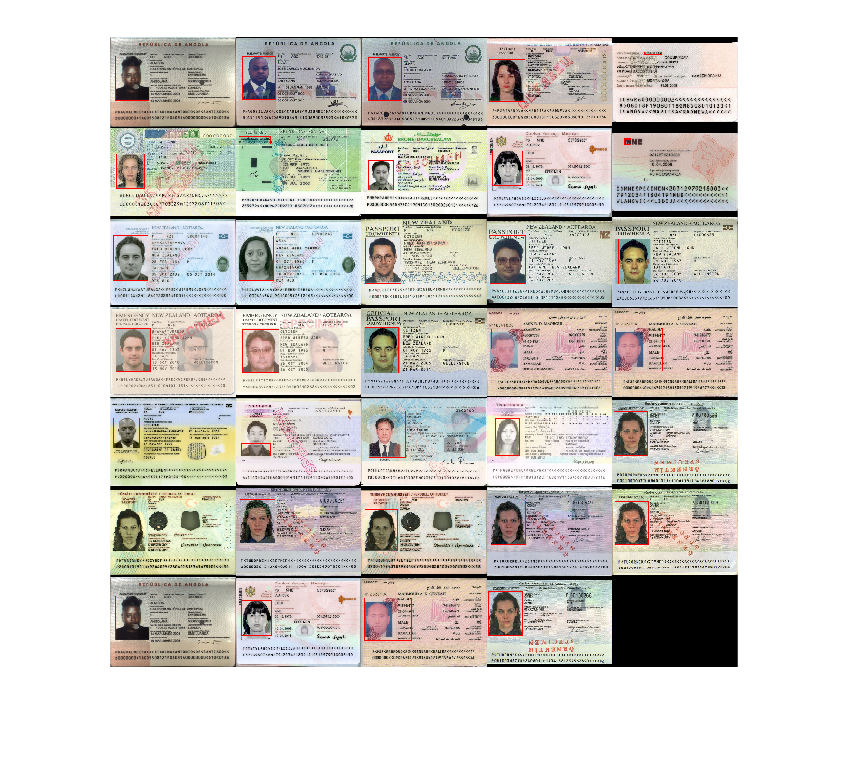
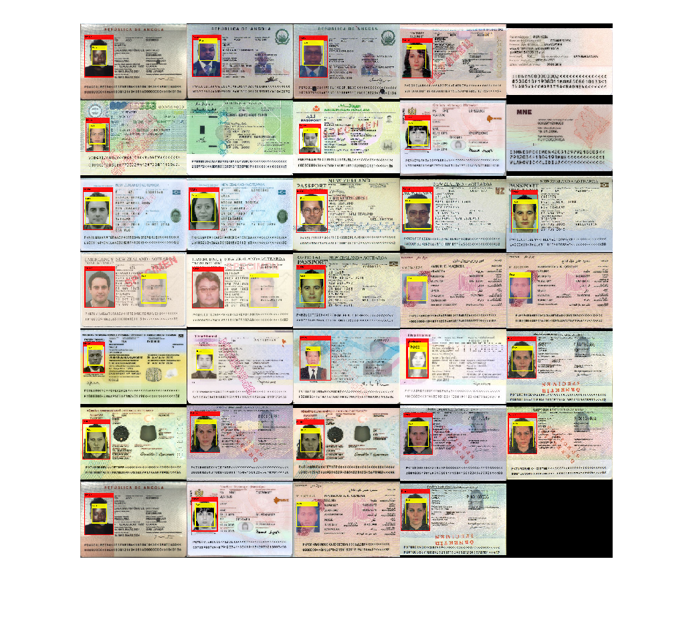
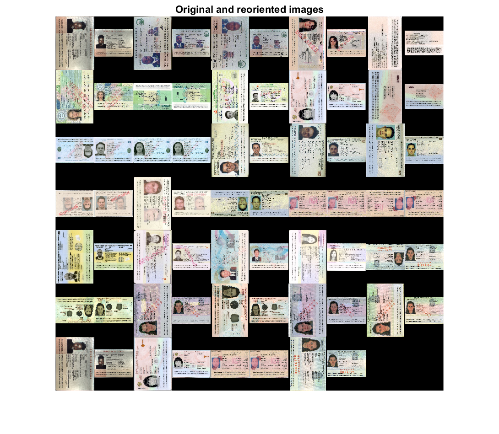

# Results obtained during the `id-card-analysis` project

## 2021.11.26: Boundary rectangles

We were able to draw boundary rectangles around the 3 largest interest regions of the scan. Coincidently, one of the boundary rectangles was around the MRZ, but this result was not reproducible on other scans. The picture, however, could be detected relatively reliably. All of this was done in a matlab live script.

**Initial approach (v1.0):**

- We make a histogram of the scan and defined a threshold by hand to then binarize the scan.
- We then compute all regions of interest and select the 3 larger area ones.
- We represents the rectangles on the original BW image.

## 2021.12.17: Apply function to array of images

- We managed to load all images recursively using `imageDataStore()`
- The commands of the live script were placed in a standalone function `detectPicture()`, that is called on the array of images.

Enhancements of the approach (v1.1):

- Threshold value is computed automatically using `otsuthresh()`
- Small objects of the BW image are removed using `bwareaopen()` -> noise reduction

Noise reduction with `bwareaopen()`, objects size = 100.

Applying `detectPicture()` function to an array of images with `bwareaopen()`, objects size = 100.

**Observation:** The qualtity of the picture detection isn't really enhanced when `bwareaopen()` is used.

## 2022.01.05: Face detection

Managed to automatically detect a face in an image. The approach only works if the image is oriented correctly. If it isn't, it either returns a random feature of the image that looks a bit like a face, or it returns an empty matrix. The code is in the `detectFace()` function.

Successful face detection

False positive on turned image

Enhancements of the approach (v1.2):

- Added gaussian filtering with `wiener2()`
- Cleared borders of image with `imclearborder()`

## 2022.01.06: Add annotations

We managed to detect the orientation of a scan, knowing that the picture is always in the left part of the scan, and that the ID card is wider that high.

Enhancements (v1.3):

- adding annotations with text labels
- we manage to show the face for an array of scans
- don't return found picture location if aspect ratio is wrong (wider than high)
- added `oriented` option in `detectPicture()`

Detecting picture and face in array of scans

Detecting the orientation of a scan

