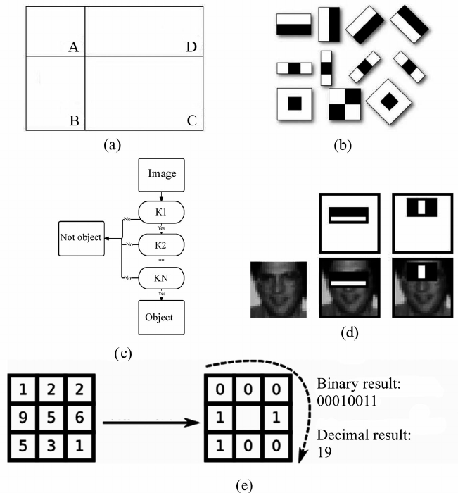

# The Viola-Jones algorithm

[Back to README](../README.md)

## Wiki article

The VIola-Jone algorithm is a really quick and simple face detection algorithm developed in the 2000.

[https://en.wikipedia.org/wiki/Viola%E2%80%93Jones_object_detection_framework](https://en.wikipedia.org/wiki/Viola%E2%80%93Jones_object_detection_framework)

## Computerphile video

[https://www.youtube.com/watch?v=uEJ71VlUmMQ](https://www.youtube.com/watch?v=uEJ71VlUmMQ)

## Problems with detecting faces

- we don't know how big the face is gonna be
- different age groups
- people wear glasses
- have to be really quick

## Viola Jones

- some parts of the faces have to be lighter/ darker than others
- you simply substract bits of the image to others. The bits are rectangular, and can have any size.
- the features AKA patterns of lighter/darker pixels, consider 2, 3 or 4 rectangles of any size
- the problem is that they are too many possibilities of rectangles to substract -> it would be too slow
- they calculate the **integral** of the image once, and then use that to do the rectangles substractions a lot faster!
- they calculate all the regions of 1,2,3,4 rectangles
- then they execute a first feature on these regions which is a 2 rectangles feature for eyes and cheeks (darker/lighter)
- they then pass a lot of different features, every time a region doesn't pass a feature, it is discarded. If it passes all the features, it's a face!

=> they then trained a model to find what was the best sequence of features (tradeof speed / false positives)

[Source](https://www.researchgate.net/figure/Viola-Jones-algorithm-parts-a-combination-of-regions-b-Haar-Features-c-cascade_fig1_282972331) -> it's a paper, might be interesting

## Another topic: face identification

Face identification is the ability to say that there is a specific person in a picture.

[https://www.youtube.com/watch?v=mwTaISbA87A](https://www.youtube.com/watch?v=mwTaISbA87A)
